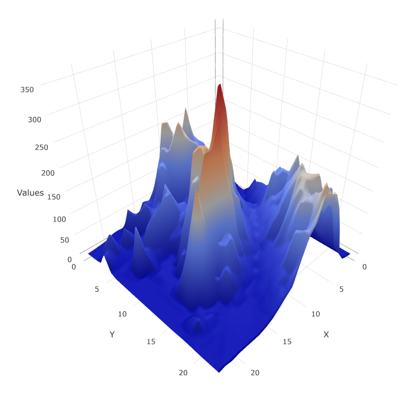

# Qlik Sense 3D Surface Chart
Qlik Sense extension for interactive 3D surface chart

## Screenshots

## Prerequisites
 * Install Qlik Sense. (Qlik Sense April 2018 release or later)

## Installation
 1. Download the latest version of Qlik Sense 3D Surface Chart extension from this repository.
 2. Install extension:
   * Qlik Sense Desktop
 	 * To install, copy the folder included the .zip file to folder "C:\Users\[%Username%]\Documents\Qlik\Sense\Extensions\".
   * Qlik Sense Enterprise
 	 * Import the zipped extension file on QMC by following the instructions of [Importing visualizations in Qlik Sense Enterprise](https://help.qlik.com/en-US/sense-developer/April2018/Subsystems/Extensions/Content/Howtos/deploy-extensions.htm)

## How to use
Find out the demo app and dataset from [Here](./docs/sample/).

## Known limitations
 * This extension cannot be exported as a PDF. Chart image can be downloaded by clicking [Download plot as a png] button placed on the top of a chart area.
 * This extension is only available on web browsers supporting WebGL. It will be available on Qlik Sense Enterprise or access to the URL of http://localhost:4848/hub on a web browser while Qlik Sense Desktop is running.

## Author

 **Masaki Hamano**
 * https://github.com/mhamano/

## License & Copyright
 The software is made available "AS IS" without any warranty of any kind under the MIT License (MIT).

 See [Additional license information for this solution.](LICENSE)
